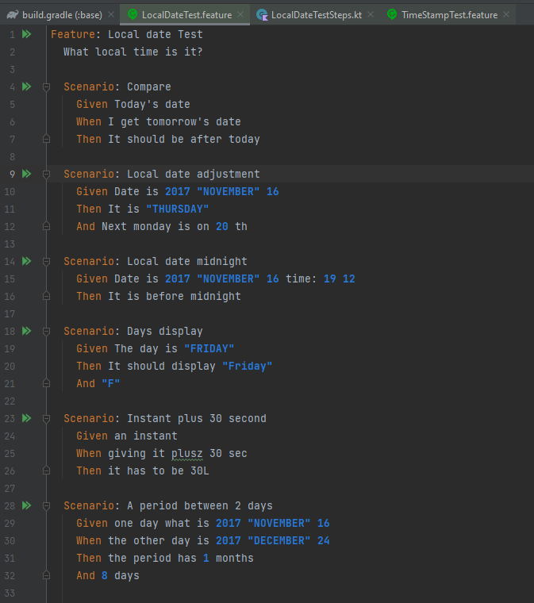

# BDD Test
A függőségeket hozzáadtuk a build.gradle fájlokban. Értelmeztük a modulokat és készítettünk teszteket a megfelelő esetekhez.

## Base module
Az alkalmazáshoz tartozó eseményeket, beállítások és értesítéseket tartalmazza

### LocalDateTest
Különböző időpontok/időzónák egymáshoz viszonyított és egymásson elvégzett műveletek helyességét vizsgálja. 

 

### TimeStampTest

A rakéták kilövésével kapcsolatos időpontokat teszteli

 

## Domain module

Létrehoztuk a teszteket és a tesztekhez szükséges Inicializáló és segéd fájlokat. Definiáltuk a tesztekhez szükséges lépéseket, de mégsem működnek. Minden létrehozott fájl megtalálható a base/src/test mappán belül az általunk létrehozott kotlin és resource mappákban.
