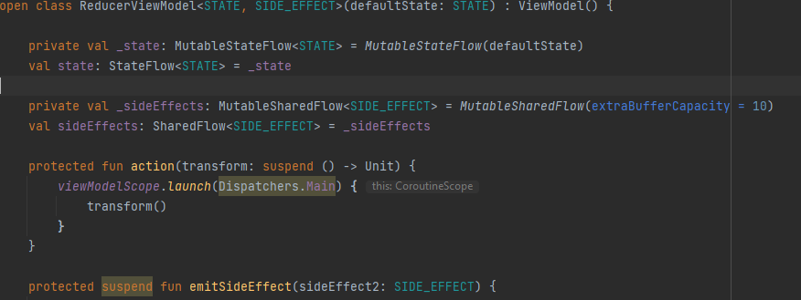
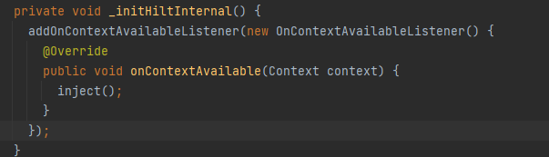

# Manuális kódátvizsgálás
## ReducerViewModel

### Diszpécserek Hard kódolása.
A diszpécserek hard-kódolása megnehezíti a tesztelést. Ha Dependency-Injection-el oldjuk meg, akkor tesztelés során egyszerűen le lehet cserélni a teszt diszpécserre, ami sokkal dinamikusabbá teheti akár a Unit-teszteket is.

 

### Exposed suspend függvények
Egy másik probléma, hogy a View-oknak nem szabadna direkt co-routin-okat inditania. épp ezért, a ViewModel-ben érdemes coroutin-okat készíteni suspend függvények helyett az üzleti logika elvégzésére. Ez jóval megkönnyíti a tesztelés folyamatát, mert a View-okkal szemben a ViewModel-eket lehet Unit-tesztelni.

 

## Hilt_MainActivity

### Anonim inner class -> lambda 
Habár ez egy generált fájl, mégis fontos az olvashatóság maximalizálása. Valószínüleg a kód generátor azért anonim osztályokat hozott létre, hogy ezek java 8 előtti verziókkal is kompatibilisek legyenek, de mivel a projectünk 11-es jdk-val dolgozik, ezt javíthatjuk.

 

## ui-timeline

### String kiszervezés változóba