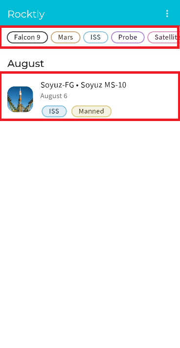

# Manuális teszt

## Tesztek megtervezése:
- Filterek működésének tesztelelése (bekapcsolás, kikapcsolás)
- Részleteket megjelenítő oldalak tesztelése (oda navigálás, visszalépés, funkciók működése)
- Beállítások tesztelése (Átállítsáskor elvárható moódosítások történnek-e?)
- A lista újratöltésének tesztelése

# Dokumentálás:

## Hiba 1:
### Probléma:
Az "Unconfirmed Launches" beállítás működése nem megfelelő. Bekapcsolás/kikapcsolás során, miután kilépünk a Settings menüből, nem jelennek meg rögtön a megfelelő változtatások (Pl.: Bekapcsolása után visszalépünk a lista nézetre, még mindig nem látjuk a meghatározatlan kilövésidejű kilövéseket). Az oldal ujratöltésével ezek a változtatások megjelennek.

 
### Lehetséges megoldás:
A beállítások változtatása után az adott lista újratöltésével ez a hiba elkerülhető lenne.

## Hiba 2:
### Probléma:
Amikor egy adott filter be van kapcsolva, és a listát újratöltjük, a filter hatása elveszik, viszont a felhasználói felületen még mindig úgy jelenik meg, mintha az engedélyezve lenne. E filteren való újboli tappintásra a UI-on ez deaktiválódik, viszont a listára ez nincs hatással.

### Lehetséges megoldás:
A lista újratöltésénél a filterek számontartása, és a betöltés elvégzése ezektől függően. Alternatív megoldás lehetne az is, ha újratöltéskor a felhasználó felületről is eltűnne a filterek bekapcsolva létét indikáló ikonszínezés.

## Hiba 3:
### Probléma:
Az egy bizonyos kilövés részleteit megjelenítő oldalakon az időpont alatt megjelennek az adott kilövéshez tartozó filterek is, viszont ezek erősen átlátszóak, így a sötét háttérkép miatt kifejezetten nehezen olvashatóak.

### Lehetséges megoldás:
Erre a problémára megoldást jelentene többek közt a filterek ikonjainak átlátszhatóságának csökkentése, vagy a háttérkép világosabbra való leváltása is.

## Hiba 4:
### Probléma:
Az egy bizonyos kilövés részleteit megjelenítő oldal bezárása után, ha oda egy filterre való szűréssel érkeztünk, a felhasználói felületről eltűnnek a megfelelő filterekhez tartozó ikonszínezések, viszont a lista szűrve marad. Újboli újratöltés után ismét visszatér a lista a szűretlen állapotába.

 
### Lehetséges megoldás:
Az egy bizonyos kilövés részleteit megjelenítő oldalról való visszanavigálás során vagy maradjanak meg a UI-on is a filterek aktiváltságát indikáló szinezett ikonok, vagy frissítsük rögtön a listát, hogy az adatok mindig konzisztensek maradjanak a felhasználói felületen indikált szűrőkkel.

## Hiba 5:
### Probléma:
Bizonyos filtereknek vannak al-filterei is (Pl.: "ISS"-nek a "Manned" és a "Soyuz"). Ha egy al-filtert is bekapcsolsz, bekapcsolva marad a szülőfiltere is, viszont annak kikapcsolásával a UI-on még mindig azt jelzi, hogy a szülőfilter bekapcsolva van, miközben a lista visszatér szűretlen állapotba.

 
### Lehetséges megoldás:
Egy al-filter kikapcsolásakor a szülőfeltétel figyelembevétele kilistázáskor.

