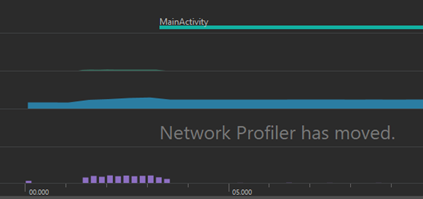
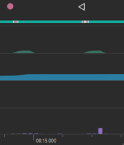
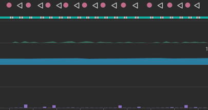
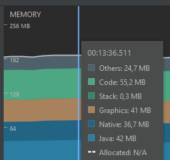
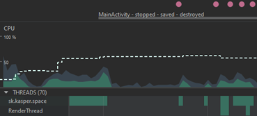
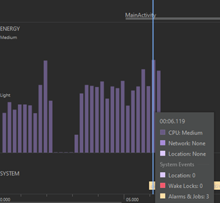

# Teljesítmény vizsgálata az Android Studio beépített eszközével (Profiler)

A tesztelés alatt a program futtatásához egy fizikai eszközt használtam, az alsó-középkategóriából. A telefon jellemző teljesítménye nagyjából megegyezik egy átlagos felhasználó készülékének jellemzőivel.
Eszköz jellemzői:
Xiaomi Redmi Note 8 Pro
Operációs rendszer: Android 10
RAM: 6 GB
CPU: 8 mag, maximum sebesség 8 GHz

## Program indítása, Startup Latency:

 
A hideg indításnak (minden előzetes betöltés nélkül) fél másodperc alatt kellene lennie, ezt a program nem tudja tartani, több, mint három másodpercbe telik elindulnia. A Google ajánlása az 500 ms, ezen bőven túllép. Ennek ellenére a használhatóságot nem befolyásolja a várakozás.
Másik Activity indítása, majd visszatérés a MainActivitybe
 
## Használhatóság
Egy egyszerű, adatok részletes megjelenítésért felelős activity nem terheli meg az eszközt, minimális processzorhasználat figyelhető meg. Az energiahasználat a MainActivity-be való visszatéréskor megemelkedik egy rövid időre.

 
Az Activity-k sorozatos megnyitása - visszatérés a főmenübe tevékenység nem terhelte meg az eszközt, a memóriahasználat nem növekedett, stabil szintet tartott.

 
## Memóriahasználat megoszlása

 
A memóriahasználat 120 MB körül mozog, indításkor enyhén megemelkedik, majd stabilizálódik. A program futása közben normál használat mellett látszódik, hogyan oszlik meg az egyes területek igénye. Nagyjából hasonló területet használnak a fő területek. Ezek az arányok nem igazán változnak a futás során, még a grafikai elemeket aktívan használó activity-k sem borítják fel az arányokat.

## Processzorhasználat jellemzői

 
A processzorhasználat panel azt mutatja, hogy a szálak száma 60 körül áll be az indítás után, valamint, hogy a főként használt szálak a kód futtatásához, illetve a megjelenítéshez, rendereléshez tartoznak. Egy-egy esetben látható, hogy nagyon rövid ideig megjelenik néhány mellékes szál, de alapvetően nem jellemző.

## Energiahasználat jellemzői

 
A legkirívóbb esetben is csak a processzorhasználat emeli meg az energiafogyasztást, medium szintre. Látszik, hogy rendszerszinten 3 job van beütemezve, ezek száma konstans a futás során.

## Biztonság
A program nem vár végrehajtható bemenetet a felhasználótól, így direkt támadás a program hívásain keresztül nem végezhető. A program hálózati forgalma egyirányú, lekérdezés jellegű, adatokat nem küld, nem módosít, csak megjelenít. A program nem tárol adatot az eszköz háttértárán, az egyetlen felhasználó által tartalmilag befolyásolható terület (Compose Playground) sem végez mentést, módosítást. A program így nem jelent kockázatot sem az eszközre, sem a szerverre nézve.

## Összefoglalás
A program futása stabil, nem jelentkeztek hibák, nem rendeltetésszerű, hanem összevissza használat esetén sem. A lehetséges use-casek végrehajtása során nem lépett fel váratlan viselkedés. A program a készülék erőforrásait nem terhelte meg, stabilan, alacsony és szükséges szinten tartotta az igénybevételt. A hálózati forgalom gyakorlatilag egyirányú, kockázatot nem jelent.
