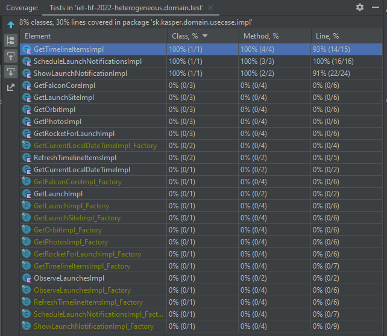
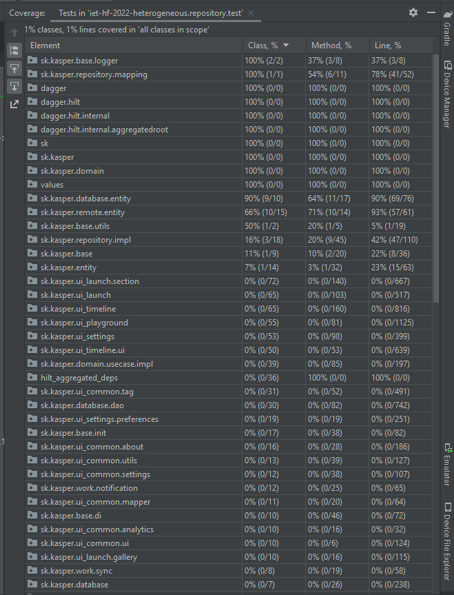

# Test coverage, Unit testing

## Test coverage

- A projektbe beépítettük a JaCoCo toolt, azonban nem sikerült vele érdemben kimutatni semmit, nem generálja le a kívánt coverage-filet. 
- Az Android Studio beépített Coverage teszt futtatása során az alábbi kimenetet kaptuk:

A projekt struktúrája borzalmasan szétszórt, a benne lévő teszteket alig lehet értelmezni / teljesen primitívek. Így nem csoda, hogy ilyen kicsi a lefedettség.

- Letöltöttünk egy generált lefedettséget bemutató weboldalt, ezt is hozzáadtuk a repository-hoz.

### Unit testing
- A kódban a meglévő tesztekből egyedül a "domain" modulban lévők közül volt érdemi. Ezeket kirgészíteni nem láttuk értelmét.
- Próbáltuk a többi unit tesztet kiegészíteni, azonban a kód összevisszasága miatt nem tudtunk érdemi eredményt hozzárakni a már meglévőkhöz.
- Nem értük el az adatbázist, a firebase-hez nincs hozzáférésünk. Logikátlanul van szétszedve modulokra a kód.
